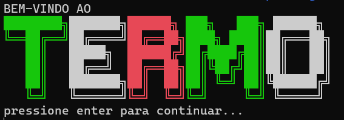
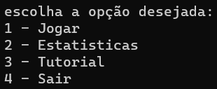
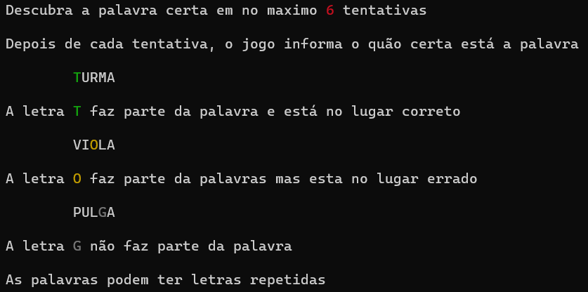
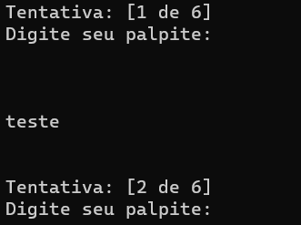
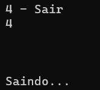

# Termo

**Disciplina**: FGA0210 - PARADIGMAS DE PROGRAMAÇÃO - T01 <br>
**Nro do Grupo (de acordo com a Planilha de Divisão dos Grupos)**: 4<br>
**Paradigma**: Funcional<br>

## Alunos
|Matrícula | Aluno |
| -- | -- |
| 20/0014447  |  André Corrêa da Silva |
| 19/0012200  |  Douglas da Silva Monteles |
| 18/0015834  |  Eliseu Kadesh Rosa Assunção Jr. |
| 20/0030469  |  Felipe Candido de Moura |
| 20/0018167  |  Gabriel Mariano da Silva |
| 19/0089601  |  João Lucas Pinto Vasconcelos |
| 15/0141629  |  Matheus Pimentel Leal |
| 19/0036940  |  Rafael Fernandes Amancio |
| 19/0038926  |  Victor Eduardo Araújo Ribeiro |

## Sobre 
Implementação do jogo [Termo](https://term.ooo) em Haskell, na qual deve-se acertar a palavra em até seis tentativas.

Após cada tentativa o jogo indica as letras nos lugares corretos, nos lugares incorretos e que não fazem parte da palavra.

Há também um sistema de estatísticas do jogador, na qual mostra quantidade de vitorias, número de jogos e a pontuação total.

Também foi criado um tutorial dentro do jogo, ensinando como se joga.

## Screenshots

Logo do jogo ao iniciar a aplicação.


## Instalação 
**Linguagens**: Haskell<br>
**Tecnologias**: Stack<br>

Para executar o projeto, basta entrar no diretório `termo` e executar o comando:

```
# entre no diretório
cd termo

# execute este comando
make build-and-run
```

Este comando inicia o processo de criação da imagem usando o docker e logo após, inicia o processo de compilação da aplicação dentro da imagem e por fim, executa o projeto permitindo que o usuário interaja por linha de comando.

Observe que o `make build-and-run` só precisa ser executado uma única vez para fins de criação da imagem, se você não modificar nada no projeto, nas próximas execuções, basta rodar o comando:

```
make up
```

Este comando pegará a imagem já criada e iniciar um novo container, anexando um terminal a ele, permitindo que você interaja com a linha de comando do container.

## Uso 
Após as execuções dos comandos acima, o jogo iniciará com a tela inicial, mostrando o nome do jogo e requisitando que pressione a tecla `enter`, ativando o menu principal da aplicação.



A opção 3 `Tutorial` mostra os principios de jogabilidade do jogo, principalmente os esquemas de cores e o objetivo do mesmo.



A opção 1 `Jogar` inicia o jogo com uma palavra escolhida aleatoriamente do banco de termos, segundo o formato apresentado no tutorial



A opção 2 `Estatisticas` abre a tela com informações sobre os jogos registrados, sendo elas, quantidade de jogos, quantidade de vitórias e pontos obtidos.

A opção 4 `Sair` encerra o jogo.



## Vídeo
Adicione 1 ou mais vídeos com a execução do projeto.
Procure: 
(i) Introduzir o projeto;
(ii) Mostrar passo a passo o código, explicando-o, e deixando claro o que é de terceiros, e o que é contribuição real da equipe;
(iii) Apresentar particularidades do Paradigma, da Linguagem, e das Tecnologias, e
(iV) Apresentar lições aprendidas, contribuições, pendências, e ideias para trabalhos futuros.
OBS: TODOS DEVEM PARTICIPAR, CONFERINDO PONTOS DE VISTA.
TEMPO: +/- 15min

## Participações
Apresente, brevemente, como cada membro do grupo contribuiu para o projeto.
|Nome do Membro | Contribuição | Significância da Contribuição para o Projeto (Excelente/Boa/Regular/Ruim/Nula) |
| -- | -- | -- |
| André Corrêa da Silva | Desenvolvimento do menu principal, tutorial e atualização do README |  Excelente  |
| Douglas da Silva Monteles | Desenvolvimento em par do módulo de validação de input |  Excelente  |
| Eliseu Kadesh Rosa Assunção Jr. |  Desenvolvimento em par do módulo de seleção aleatória de palavras |  Excelente  |
| Felipe Candido de Moura | Desenvolvimento em par do módulo de estatísticas do jogo  |  Excelente  |
| Gabriel Mariano da Silva |  Desenvolvimento em par do módulo de estatísticas do jogo |  Excelente  |
| João Lucas Pinto Vasconcelos | Desenvolvimento da inteface do usuário no jogo e integração dos módulos |  Excelente  |
| Matheus Pimentel Leal | Desenvolvimento em par do módulo de seleção aleatória de palavras |  Excelente  |
| Rafael Fernandes Amancio | N/A |  Nulo  |
| Victor Eduardo Araújo Ribeiro | Desenvolvimento em par do módulo de validação de input |  Excelente  |

## Outros 

Foi um trabalho muito interessante de ser feito, necessitando de um olhar diferente do que estavamos acostumados com os paradigmas imperativo e/ou orientado a objetos.

Fazer um jogo sempre é um método bom de se exercitar um aprendizado novo, visto que se torna algo mais lúdico, entretanto, é notável que apenas esse projeto não é o suficiente para se masterizar a linguagem, muito menos a forma de se utilizar o paradigma.

Dessa forma, vale ressaltar os seguintes pontos:
- Lições aprendidas: 
    - Aprendemos a base do paradigma funcional e que, para conseguirmos usa-lo bem, devemos deixar para trás o pensamento imperativo e pensar de forma mais matemática/funcional.
    - Aprendemos a base da linguagem Haskell de forma que, se necessário, possamos utiliza-la em projetos futuros, mas, da mesma forma que no tópico anterior, ainda devemos exercita-la mais.
- Percepções:
    - É visivel o motivo de o paradigma funcional conquistar tantas pessoas, ele é muito amigável a aqueles que tem uma afinidade acima da média com a matemática e suas áreas relacionadas.
- Contribuições e Fragilidades:
    - A equipe orquestrou bem os trabalhos que deveriam ser feitos, cada dupla/pessoa ficou responsável por um módulo e no final fizemos as integrações em conjunto (André, Douglas e João), buscando a união mais agradável possivel.
    - A equipe ainda pode melhorar em alguns pontos, entre eles, o que mais se destaca é a comunicação, visto que há uma pequena falta de conversa entre os membros.
- Trabalhos futuros:
    - Para se avançar o projeto, seria muito interessante a criação de uma interface gráfica mais agradável que o terminal.
    - Outra adição interessante seria a adição de outros modos de jogo existentes no [termo](https://term.ooo), o dueto e o quarteto, duas e quatro palavras simultaneas, respectivamente.


## Fontes
Referencie, adequadamente, as referências utilizadas.
Indique ainda sobre fontes de leitura complementares.
